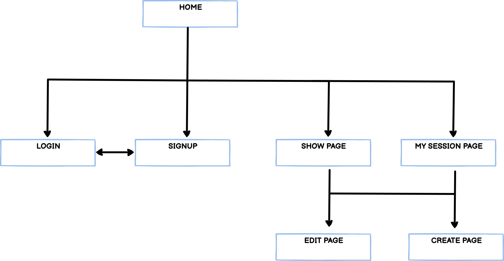
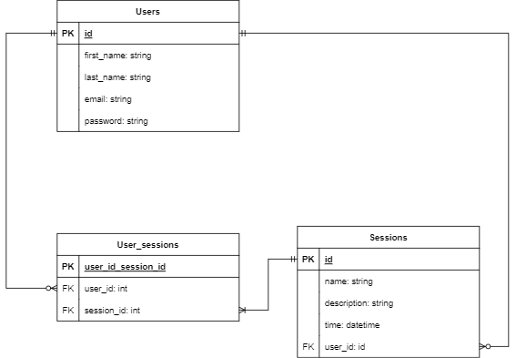

## Setup

1. yarn
2. yarn build
3. yarn build:css
4. rails db:migrate
5. rails db:seed (For development)

## Issue and why does it need solving?

The issue is that there isn't many web applications that can help people create and organise events with other people. Events such as study groups, parties or reoccuring sport socials to name a few.  

## URL 
https://t2a2-session-app.herokuapp.com/

## Github
https://github.com/caovinhlam/MarketplaceApp

## Description

### Features

Account Management:
- [x] Users can create an account
- [x] Users can login/logout
- [ ] User profiles can be edited
- [ ] User can upload an image for a profile picture

Sessions:
- [x] Users can Create study sessions
- [x] Users can Edit, Delete sessions that they have created
- [ ] Users can signup/cancel to available sessions

### Sitemap



### Target Audience
Students who want to organise study sessions with other students.

### Tech Stack
 &nbsp;&nbsp;  &nbsp;&nbsp;  &nbsp;&nbsp;  &nbsp;&nbsp;  &nbsp;&nbsp; 

## User Stories
- As a USER I would like to CREATE an account
- As a USER I would like to LOGIN/LOGOUT
- As a USER I would like to change/reset my password
- As a USER I would like to UPLOAD an image
- As a USER I would like to UPDATE my profile picture
- As a USER I would like to VIEW/CREATE/EDIT/DELETE a study SESSION
- As a USER I would like to SIGNUP to a study SESSION
- As a USER I would like to CANCEL a SIGNUP to a study SESSION

## Explain the different high-level components (abstractions) in your app

## Detail any third party services that your app will use

## ERD and Schema



## Describe your projects models in terms of the relationships (active record associations) they have with each other
There is a many to many relationship between USERS and SESSIONS therefore a linking table needs to be created called USER_SESSIONS
```ruby
Model: USER
user  has_many :sessions, dependent: :destroy
      has_many :user_sessions
      has_many :sessions, through: :user_sessions
Model: SESSION
session  belongs_to :user
         has_many :user_sessions
         has_many :users, through: :user_sessions
Model: USER_SESSION
user_session  belongs_to :user
              belongs_to :session
```

## Discuss the database relations to be implemented in your application
- USERS can create zero to many SESSIONS
- A SESSION belongs to a User
- A USER can sign up to zero to many SESSIONS through USER_SESSION
- A SESSION can have one to many USERS signup through USER_SESSION
- A USER_SESSION belongs to a USER
- A USER_SESSION belongs to a SESSION

## Wireframes

.png)
<br/>

.png)
<br/>

.png)
<br/>

.png)
<br/>

.png)
<br/>

.png)
<br/>