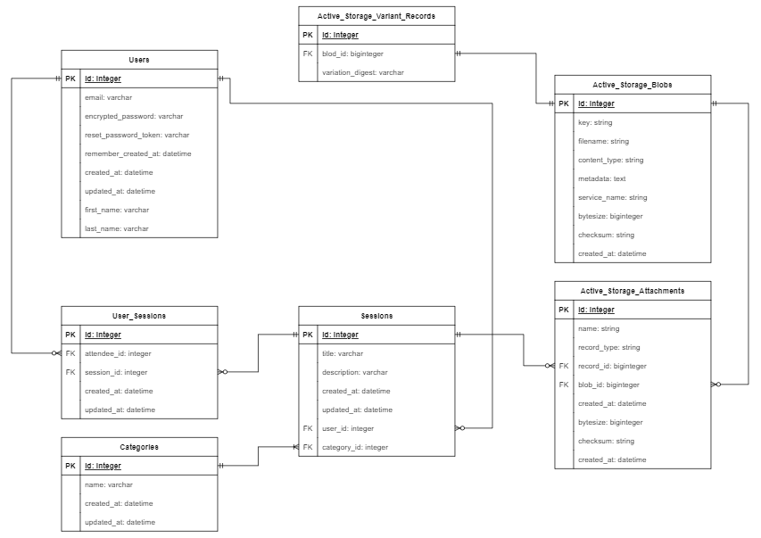

## Setup

1. yarn
2. yarn build
3. yarn build:css
4. rails db:migrate
5. rails db:seed (For development)

## Issue and why does it need solving?

The issue is that there isn't many web applications that can help people create and organise events with other people such as study groups, parties or reoccuring sport socials to name a few. 
Allowing the host to manage their own sessions and seeing who and how many people are attending will greatly aid them in making sound decisions for their preperation of the event.

This app solves this issue by allowing the user to create, edit and delete sessions that they have created. Other users can sign up to available events and cancel their signup anytime if they choose not to attend anymore.

## URL 
https://t2a2-session-app.herokuapp.com/

## Github
https://github.com/caovinhlam/MarketplaceApp

## Description

### Features

Account Management:
- [x] Users can create an account
- [x] Users can login/logout
- [ ] User profiles can be edited
- [ ] User can upload an image for a profile picture

Sessions:
- [x] Users can Create study sessions
- [x] Users can Edit, Delete sessions that they have created
- [ ] Users can signup/cancel to available sessions

### Sitemap


### Target Audience
Any users who want to create events or participate them.

### Tech Stack
 &nbsp;&nbsp;  &nbsp;&nbsp;  &nbsp;&nbsp;  &nbsp;&nbsp;  &nbsp;&nbsp; 

## User Stories
- As a USER I would like to CREATE an account
- As a USER I would like to LOGIN/LOGOUT
- As a USER I would like to change/reset my password
- As a USER I would like to UPLOAD an image
- As a USER I would like to UPDATE my profile picture
- As a USER I would like to VIEW/CREATE/EDIT/DELETE a SESSION
- As a USER I would like to SIGNUP to a study SESSION
- As a USER I would like to CANCEL a SIGNUP to a SESSION
- As a USER I would like to VIEW all SESSIONS that I have created
- As a USER I would like to VIEW all SESSIONS that I have signed up for

## Explain the different high-level components (abstractions) in your app

The Rails applications follows the MVC design pattern (Model, View, Controller) where each components has its own responsibility and serves a specific function for the web application. Therefore,  this makes the application more modular where making changes to one part of the application will not affect the other two. In MVC the model is the database of the application and in Rails, we use Active Record to abstract the database queries to the framework so that the developer does not have to worry about the syntax of a specific database. The controller is the logic base for the view and model where it can retrieve data and parse the data from the model and handle what contents are displayed on the view. Finally the view handles the user interface.

When a user types a URL to the web browser, a request gets made to the server where the Rails application is being hosted. These request can either be a GET, POST, PATCH, PUT, or DELETE. When the Rails application receives this request, it will first check if the URL routing exist and if it does then it will route it to the appropriate controller. From there the controller will decide if it needs to grab data from the model and will render the view accordingly. Once the view is rendered the request is sent back to the user's browser wher it will be displayed to the user.

## Detail any third party services that your app will use

Heroku is a cloud platform as a service and supports a lot of programming languages such as Java, Ruby, Python, PHP, Node.js and many more so that developers won't have to worry about which language to develop their application on. Being a polyglot platform, Heroku has a lot features that developers can use to build, run and scale their applications. When developers deploy their application into the Heroku servers, it runs on a virtual container called "Dynos" to gets executed on a reliable runtime environment. Developers can easily scale their app by either increasing the number of dynos or changing the type of dyno to run the app on. Heroku uses PostGreSQL to run its Cloud Database service. It's very easy for developers to deploy their application into Heroku as once Heroku's cli has been installed, developers can use git commands followed by heroku to push their repository into production.

## ERD and Schema



## Describe your projects models in terms of the relationships (active record associations) they have with each other

In the application there are 3 models which the application uses being the USER, SESSION and USER_SESSION model. There is a relationship between a USER and SESSION in that a user being a host can create a session and that session belongs to the user. Since the relationship is one to many being that sessions can be created by many users, we set the active record assocition as user has_many sessions and session belongs_to one user.

There is a unique relationship that USER has with SESSION in that a user being an attendee can signup to many sessions and that a session can have many attendees. Thus this creates a many to many relationship between USERS and SESSIONS and therefore a third model being a linking table needs to be created to create an relationship between the two models. This model is called USER_SESSIONS and will have the user id and session id as its foreign key so that it can link a single user to a single session. Therefore for our models we set this association up by having user has_many user_sessions followed with has_many sessions through user_sessions. This can also be done on the opposite with session in that a session has_many user_sessions followed with has_many users through user_sessions. Finally we set up the USER_SESSION model by having it belong_to both the USER and SESSION model.

```ruby
Model: USER
user  has_many :sessions, dependent: :destroy
      has_many :user_sessions
      has_many :sessions, through: :user_sessions
Model: SESSION
session  belongs_to :user
         has_many :user_sessions
         has_many :users, through: :user_sessions
Model: USER_SESSION
user_session  belongs_to :user
              belongs_to :session
```

## Discuss the database relations to be implemented in your application
- USERS can create zero to many SESSIONS
- A SESSION belongs to a User
- A USER can sign up to zero to many SESSIONS through USER_SESSION
- A SESSION can have one to many USERS signup through USER_SESSION
- A USER_SESSION belongs to a USER
- A USER_SESSION belongs to a SESSION

## Wireframes

.png)
<br/>

.png)
<br/>

.png)
<br/>

.png)
<br/>

.png)
<br/>

.png)
<br/>